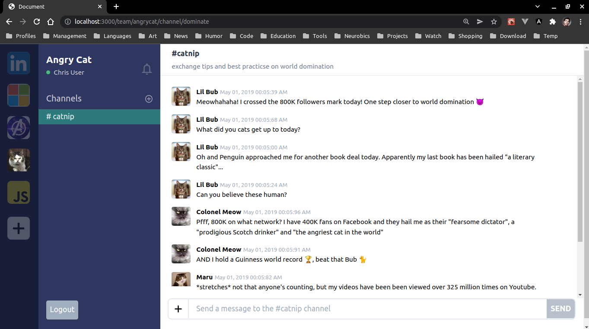

# Production-Grade TypeScript

_Learn to use the TypeScript language at scale to increase the developer experience and productivity of your teams! Work with declaration files and definitely typed, and learn to test pure type information. You’ll build a Slack app with a data layer that balances performance and safety and includes automatic detection of API surface changes. By the end, you’ll be able to manage even the most ambitious TypeScript projects with confidence and ease._

## Reference

[Production-Grade TypeScript](https://frontendmasters.com/courses/production-typescript/) (Frontend Masters)

## Preview

