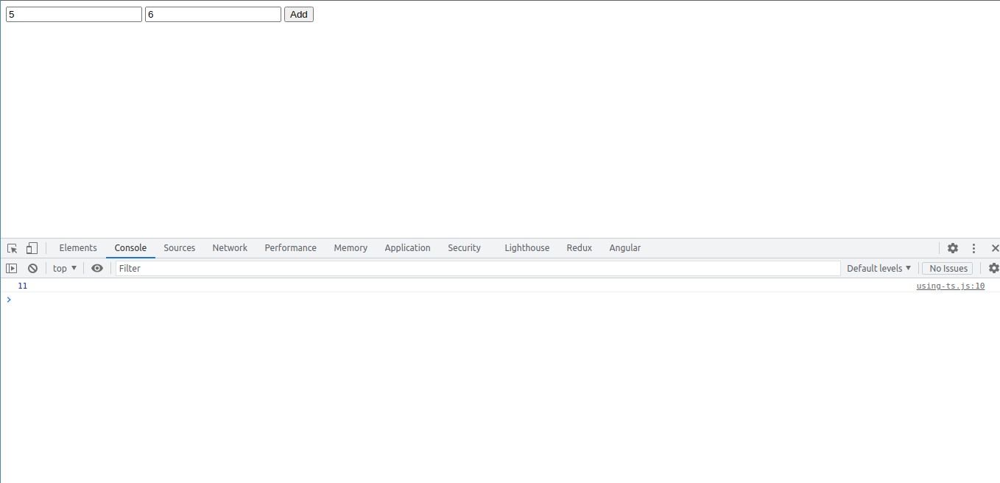

# :eyes: Preview

## :writing_hand: Notes

- The key difference is: **JS** uses **dynamic types** (resolved at runtime), **TS** uses **static types** (set during development).
- That means TypeScript type system only helps during development (i.e. before the code gets compiled).

### Getting started

- Installation (globally):

`npm install -g typescript`

- Compiling (generates _helloworld.js_ file):

`tsc helloworld.ts`

### Useful extensions for VSCode:

- ESLint
- Material Icon Theme
- Path Intellisense
- Prettier

### Understanding TypeScript

- Creating _package.json_ file:

`npm init`

- Installing (development) dependencies exclusive to this project:

`npm install --save-dev lite-server`

- Then adding a new entry to _scripts_ on _package.json_:

`"start": "lite-server"`

- Running the project will start the execution of _lite-server_:

`npm start`

### TypeScript Compiler

- Enabling watch mode turns compilation automatic after saving the file:

`tsc app.ts --watch` or simply `tsc app.ts -w`

- What if we have multiple files:

`tsc --init`

- It's also possible to watch multiple files:

`tsc -w`

- Diving into _tsconfig.json_ file:

- `"exclude"`: allows to ignore specific files from compilation.
- `"include"`: specifies which files should be compiled.

- compilerOptions:

- `"target"`: version of the generated JavaScript file.
- `"sourceMap"`: allows access TypesCript files on the browser ('Sources' tab), simplifying debug.
- `"outDir"`: specifies where the created files should be stored.
- `"rootDir"`: prevents TypeScript to look for _.ts_ files inside all the folders.
- `"removeComments"`: self explanatory, turning JavaScript files cleaner.
- `"noEmitOnError"`: prevents from generating JavaScript files if some error occurs.
- And more to explore...

### Debugging

- Install **Debugger for Chrome**.

- Or via VSCode through **Run -> Start debugging**.

- Configure _launch.json_, changing port to 5500 (lite-server).

- Add some breakpoints to specific lines.
